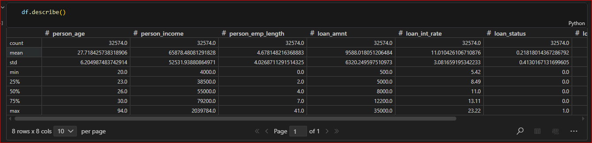
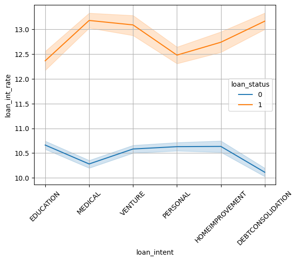
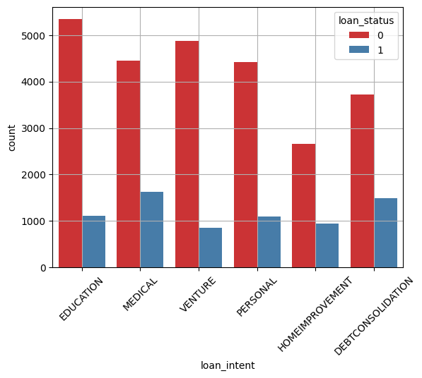
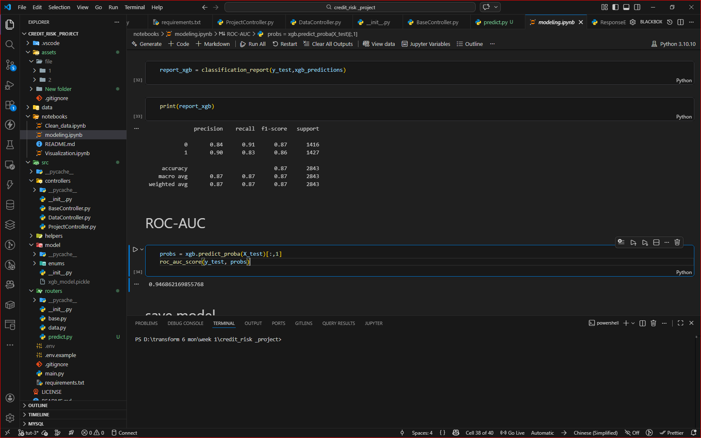

# Credit Risk Project

## Overview
This project focuses on analyzing and modeling credit risk using machine learning techniques. The project includes data cleaning, exploratory data analysis, and predictive modeling to assess credit default risk.

## Project Structure

```
credit_risk_project/
├── README.md                          # Project documentation
├── data/
│   ├── credit_risk_dataset.csv       # Raw credit risk dataset
│   └── data_clean.csv                 # Cleaned and processed data
├── notebooks/
│   ├── Clean_data.ipynb              # Data cleaning and preprocessing
│   ├── Visualization.ipynb           # Exploratory data analysis and visualizations
│   └── modeling.ipynb                 # Model development and evaluation
└── src/                               # Source code and utilities
```

## Notebooks

### 1. Clean_data.ipynb
- Data loading and exploration
- Handling missing values
- Feature engineering
- Data preprocessing and cleaning
- Output: data_clean.csv


### 2. Visualization.ipynb
- Exploratory Data Analysis (EDA)
- Statistical summaries
- Visualization of key features
- Distribution analysis
- Correlation analysis




### 3. modeling.ipynb
- Model development and selection
- Training and evaluation
- Performance metrics
- Feature importance analysis



## Data

- **credit_risk_dataset.csv**: Original raw data with credit risk information
- **data_clean.csv**: Cleaned and preprocessed data ready for modeling

## Getting Started

1. Install required dependencies
2. Run the notebooks in order:
   - Clean_data.ipynb
   - Visualization.ipynb
   - 
   - modeling.ipynb
## Requirements

- Python 3.10

#### Install Dependencies

```bash
sudo apt update
sudo apt install libpq-dev gcc python3-dev
```

#### Install Python using MiniConda

1) Download and install MiniConda from [here](https://docs.anaconda.com/free/miniconda/#quick-command-line-install)
2) Create a new environment using the following command:
```bash
$ conda create -n credit-risk python=3.10
```
3) Activate the environment:
```bash
$ conda activate credit-risk
```


## Installation

### Install the required packages

```bash
$ pip install -r requirements.txt
```

### Setup the environment variables

```bash
$ cp .env.example .env
```

## Run the FastAPI server (Development Mode)

```bash
$ uvicorn main:app --reload --port 5000
```