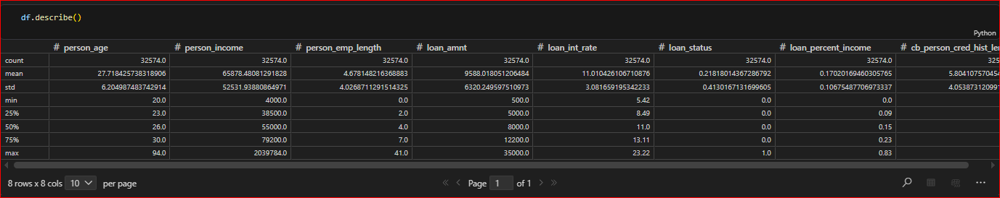
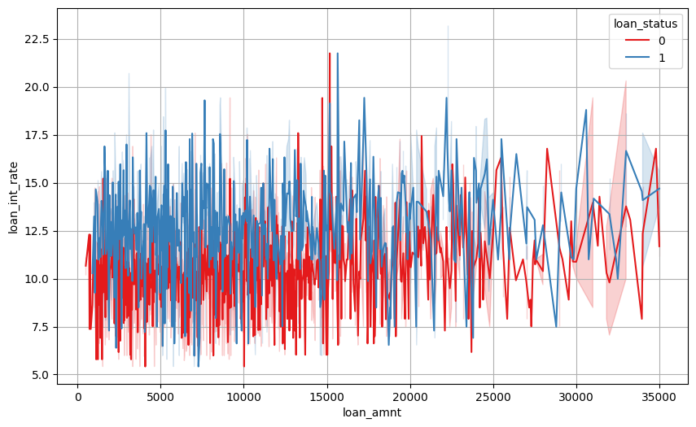

# Credit Risk Prediction Project

## Overview

This project analyzes and predicts **credit default risk** using machine learning techniques. The workflow includes data cleaning, exploratory data analysis (EDA), and predictive modeling to identify patterns related to credit risk.

The goal of the project is to build a model that helps financial institutions assess whether a borrower is likely to **default on a loan** based on financial and demographic features.

---

# Project Structure

```
credit_risk_project/
│
├── README.md
│
├── data/
│   ├── credit_risk_dataset.csv      # Raw dataset
│   └── data_clean.csv               # Cleaned dataset used for modeling
│
├── notebooks/
│   ├── Clean_data.ipynb             # Data cleaning and preprocessing
│   ├── Visualization.ipynb          # Exploratory Data Analysis (EDA)
│   └── modeling.ipynb               # Model training and evaluation
│
├── assets/
│   ├── eda_distribution.png
│   ├── eda_correlation.png
│   ├── eda_feature_analysis.png
│   └── model_results.png
│
└── src/
```

---

# Notebooks

## 1. Clean_data.ipynb

This notebook performs the **data preprocessing pipeline**, including:

* Loading the dataset
* Inspecting missing values
* Handling missing data
* Feature engineering
* Data cleaning and transformation
* Exporting the processed dataset

Output:

```
data/data_clean.csv
```

Example preprocessing result:



---

## 2. Visualization.ipynb

This notebook focuses on **Exploratory Data Analysis (EDA)** to understand the dataset and identify patterns related to credit risk.

Key steps include:

* Statistical summaries
* Feature distribution analysis
* Credit risk comparison across variables
* Correlation analysis
* Data visualization

Example visualizations:




---

## 3. modeling.ipynb

This notebook builds and evaluates **machine learning models** for predicting credit default.

Steps include:

* Data preparation
* Train/Test split
* Model training
* Model evaluation
* Performance metrics
* Feature importance analysis

## Data

- **credit_risk_dataset.csv**: Original raw data with credit risk information
- **data_clean.csv**: Cleaned and preprocessed data ready for modeling

## Getting Started

1. Install required dependencies
2. Run the notebooks in order:
   - Clean_data.ipynb
   - Visualization.ipynb
   - modeling.ipynb

## Requirements

- Python 3.x
- Pandas
- NumPy
- Scikit-learn
- Matplotlib
- Seaborn
- Jupyter Notebook

## Authors
Credit Risk Analysis Team

## Date
March 2026
